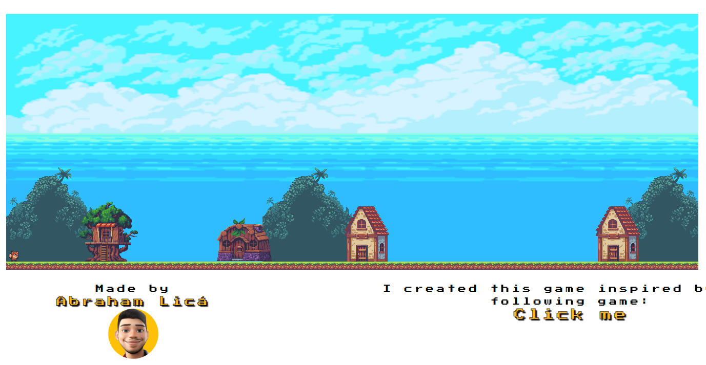

# Meu primeiro jogo 👾

Esse projeto é um projeto um tanto que especial, pois foi a primeira vez que me aventurei a usar o canvas. Quebrei muito a cabeça para entender como funciona, mas consegui um resultado razóvael no final. O projeto possui funcionalidades básicas de movimentação, mas acredite, deu um trabalhão. 😅

# Tecnologias usadas 👨🏻‍💻

#### Linguagem
- Javascript

#### Estilização
- CSS3

### Autor

- [@AbrahamLica](https://www.github.com/AbrahamLica)  

<h3>Screenshot</h3>

